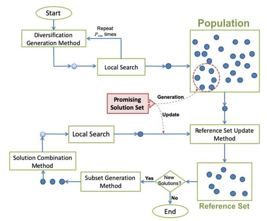

# Trabalho prático de Programação Matemática
### Alunos: Felipe Geraldo de Oliveira e Eduardo Cesar Cauduro Coelho

## Apresentação do problema
Suponha que uma mensagem classificada como suspeita por meio de uma rede neural seja enviada através de um vértice $s ∈ V$ de uma rede modelada por um grafo direcionado $G = (V, E)$. O conjunto de vértices $V$ corresponde aos servidores que processam as informações, enquanto os arcos $(u, v) ∈ E$ são os enlaces de comunicação entre os servidores $u, v$. Deseja-se reduzir o número de servidores que a notícia falsa pode se encontrar após um período de tempo igual a $T$.

A propagação de uma informação no enlace $(u, v) ∈ E$ possui tempo estimado igual a $t_{uv}$. O Setor de Tecnologia da Informação (STI) do governo federal possui α recursos (softwares auxiliares, por exemplo) tecnológicos que podem ser aplicados aos servidores para retardar o tempo de broadcast da _fake news_. Assim, caso o servidor u possua algum dos $α$ recursos instalado, o tempo de transmissão da _fake news_ no enlace $(u, v)$ seria $t_{uv} + δ$, em que $δ > 0$ representa um atraso de propagação. Cada um dos $i = 1, ..., α$ recursos fica disponível no instante $β_i$.
A solução do problema consiste em determinar a designação dos recursos aos servidores. Cada servidor receberá, no máximo, um recurso. O objetivo definido é a minimização da quantidade de servidores que a _fake news_ poderia chegar e um tempo menor ou igual a $T$.

## Framework da Scatter Search


Acima temos uma imagem que representa os módulos utilizados na metaheurística, que serão definidos a seguir:

**Diversification Generation Method:** Gera soluções iniciais para a execução do algoritmo. Essas soluções podem ser obtidas através de métodos estocásticos – como uma seleção aleatória dos valores das variáveis – ou através de heurísticas e métodos determinísticos.

**Local Search:** Realiza uma busca local visando melhorar as soluções encontradas. Podem ser utilizadas estratégias de first improvement (a primeira melhoria é escolhida) ou best improvement (a melhor melhoria é escolhida).

**Population:** Armazena um conjunto de soluções do problema.

**Reference Set:** Armazena um conjunto menor de soluções do problema, sendo normalmente um número dez vezes menor que a Population

**Reference Set Update Method:** Seleciona as soluções que vão compor o Reference Set. A seleção deve se preocupar com dois fatores: qualidade e diversidade. As soluções devem ser boas e ao mesmo tempo diversas para que haja uma convergência evitando que a solução fique presa em mínimos locais.

**Subset Generation Method:** Gera subconjuntos através das soluções contidas no Reference Set. É comum a geração de pares de soluções, dessa forma, são gerados $(n²-n)/2$ pares para um Reference Set com n soluções.

**Solution Combination Method:** Combina os pares de soluções obtidos através do Subset Generation Method, gerando uma ou mais soluções que passarão por um processo de Local Search para que possam ser possivelmente incluídos no Reference Set.

## Instruções de uso
Clone o repositório:
```
git clone git@github.com:FelipeOliveira456/Trabalho_Programacao_Matematica.git
```

Entre na pasta `src`:
```
cd Trabalho_Programacao_Matematica/src
```

Rode o arquivo `scatter_search.py`:

```
python3 scatter_search.py -o <arquivo_saida> -i <arquivo_entrada> --it_improv <número_inteiro_positivo> --ref_size <número_inteiro_positivo> --ref_prop <número_entre_0_e_1> --it_scatter <número_inteiro_positivo>
```

Argumentos necessários:
```
  -i ou --input:  caminho do arquivo de entrada
  -o ou --output: caminho do arquivo de saída
  --it_improv:    número de iterações na função de melhoria de soluções (inteiro positivo)
  --ref_size:     tamanho do ref_set (inteiro positivo)
  --ref_prop:     proporção de soluções de qualidade vs diversidade (entre 0 e 1)
  --it_scatter:   número de iterações do algoritmo geral (inteiro positivo)
```

Instâncias de teste podem ser encontradas na pasta `instances`.